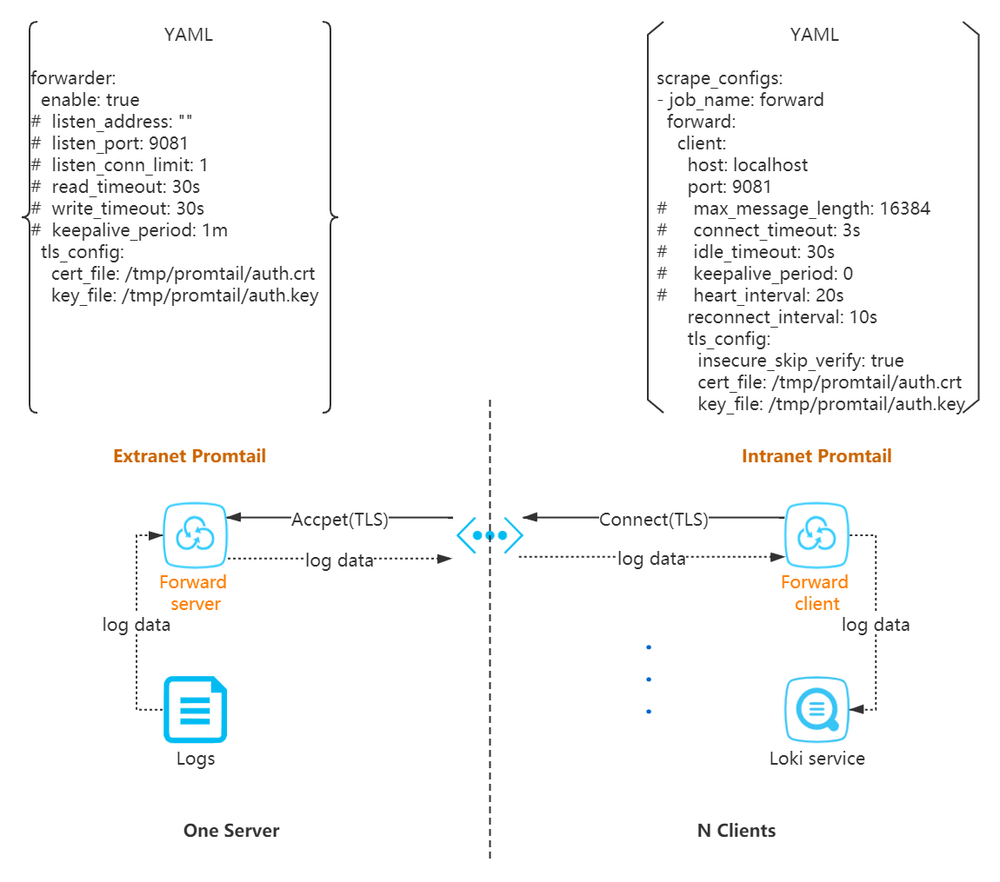

<p align="center"></p>

# Promtail: reserve forward promtail for loki

The `reserve forward promtail` is the agent based on [loki promtail](https://github.com/grafana/loki.git) with reserve forward server and client, responsible for gathering logs and sending them to Loki.

## Diagram (1 x N)

<p align="center"></p>

## Building from source

To build Promtail on non-Linux platforms, use the following command:

```bash
$ go build ./cmd/promtail
```

On Linux, Promtail requires the systemd headers to be installed for
Journal support.

With Journal support on Ubuntu, run with the following commands:

```bash
$ sudo apt install -y libsystemd-dev
$ CGO_ENABLED=1 go build ./cmd/promtail
```

With Journal support on CentOS, run with the following commands:

```bash
$ sudo yum install -y systemd-devel
$ CGO_ENABLED=1 go build ./cmd/promtail
```

Otherwise, to build Promtail without Journal support, run `go build`
with CGO disabled:

```bash
$ CGO_ENABLED=0 go build ./cmd/promtail
```

## License

Apache License 2.0, see [LICENSE](LICENSE).
